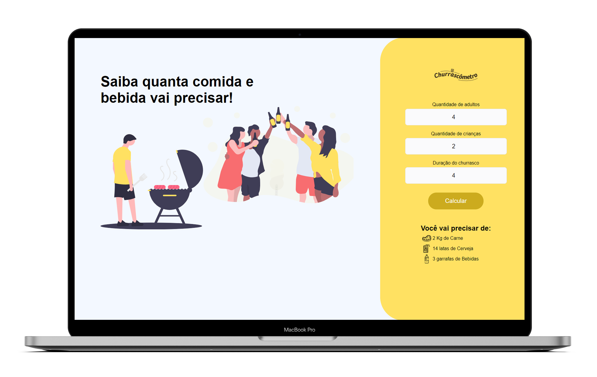

   

	
  

  

  

   Projeto feito no curso do ProgBR

  

  <a href="#clipboard-sobre-o-projeto">Sobre o Projeto</a>&nbsp;&nbsp;&nbsp;|&nbsp;&nbsp;&nbsp;
  <a href="#art-layout">Layout</a>&nbsp;&nbsp;&nbsp;|&nbsp;&nbsp;&nbsp;
  <a href="#computer-tecnologias-utilizadas">Tecnologias</a>&nbsp;&nbsp;&nbsp;|&nbsp;&nbsp;&nbsp;
  <a href="#rocket-como-rodar-o-projeto">Como rodar o projeto</a>&nbsp;&nbsp;&nbsp;|&nbsp;&nbsp;&nbsp;
  <a href="#closed-book-licença">Licença</a>

## :clipboard: Sobre o Projeto

Sitema para calcular a quantidade de comida e bebida necessária para um churrasco,
com base nas informações seguintes:
Carne - 400gr por pessoa + de 6horas - 650gr
Cerveja - 1200ml por Pessoa + 6 horas - 2000ml
Refrigerante/água - 1000ml por pessoa + 6 horas 1500ml

Crianças valem por 0,5

## :computer: Tecnologias utilizadas

O projeto foi desenvolvido utilizando as seguintes tecnologias:

- HTML
- CSS
- JavaScript

## :closed_book: Licença

Esse projeto está sob a licença MIT. Veja o arquivo [LICENSE](https://github.com/karoltaka/churrascometro/blob/master/LICENSE) para mais detalhes.
